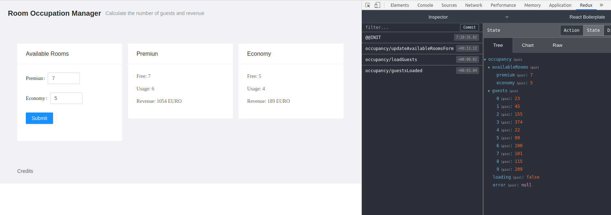

# Room Occupancy Manager

A simple Room Occupancy Manager for the Hospitality Industry (coding challenge). Click [here](https://karoldavid.github.io/room-occupancy-manager/) to see the live version.

### Prerequisites

1. Node.js. It is recommended to use the [Node Version Manager](https://github.com/nvm-sh/nvm/blob/master/README.md).
2. Add [Redux DevTools](https://chrome.google.com/webstore/detail/redux-devtools) to the browser.

## Installing

- Clone or download the repository `git clone --depth=1 https://github.com/karoldavid/room-occupancy-manager.git`.
- `cd` into the project director and run `npm install` to install the dependencies.
- Execute `npm start` to launch the application.
- Open a browser and navigate to `http://localhost:3000/`.

## Testing

Execute `npm run test` to watch for changes and run all tests.

## How to use

- Enter the number of available rooms for each room category.
- Hit the submit button.
- A mocked request fetches guest data.
- A loading indicator shows.
- The detail views display the calculated revenue and room occupancy.

## Built With

- [Create React App template of React Boilerplate Typescript](https://github.com/react-boilerplate/react-boilerplate-cra-template)
- [React Redux](https://github.com/reactjs/react-redux)
- [Redux Saga](https://redux-saga.js.org/)
- [Ant Design](https://ant.design/)

## Author

- **Karol Zyskowski**

Questions? Send an email to: k.zysk@zoho.com

## License

The [MIT License](./LICENSE) (MIT).
